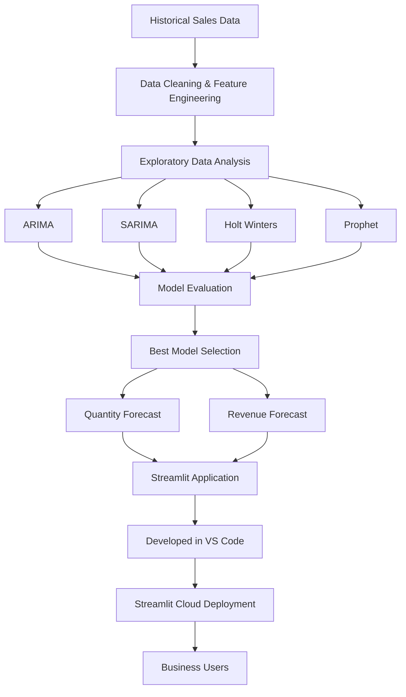

# Sales Forecasting Application

Aplikasi ini dibangun untuk memprediksi penjualan (Quantity) dan Revenue menggunakan beberapa metode time series forecasting, kemudian di-deploy menjadi aplikasi web interaktif menggunakan Streamlit.

## Live Demo

https://forecasting-app-cyk2hztaznxwjs3t2zggp9.streamlit.app

---

# Project Objective

Perusahaan sering menghadapi masalah:

* Overstock (stok berlebih)
* Stockout (kehabisan stok)
* Kesulitan menentukan target penjualan
* Perencanaan pembelian yang kurang akurat

Project ini bertujuan menghasilkan forecast penjualan yang dapat digunakan sebagai dasar pengambilan keputusan operasional dan bisnis.

---

# Workflow Project

## 1. Data Collection

Data historis penjualan digunakan sebagai sumber utama forecasting.

Data mencakup:

* Tanggal transaksi
* Quantity penjualan
* Harga rata-rata
* Revenue
* Faktor ekonomi (inflasi, nilai tukar, harga BBM)
* Kategori produk

Output tahap ini adalah dataset yang siap dianalisis.

---

## 2. Data Understanding

Dilakukan pengecekan:

* Struktur data
* Missing values
* Duplicate data
* Distribusi data
* Hubungan antar variabel

Hasil utama:

* Data penjualan memiliki pola fluktuatif
* Terdapat outlier pada quantity dan revenue
* Variabel ekonomi memiliki pengaruh yang relatif kecil terhadap penjualan

Tahap ini membantu memahami karakteristik data sebelum membangun model.

---

## 3. Feature Engineering

Beberapa fitur tambahan dibuat untuk menangkap pola bisnis yang tidak terlihat secara langsung.

Contohnya:

### Time Features

* Year
* Month
* Day
* Day of Week
* Week of Year

### Business Features

* Payday Period
* Harbolnas Event
* Ramadan Event
* Eid Event

### Historical Features

* Lag 1
* Lag 7
* Rolling Average

Tujuannya adalah menangkap pola musiman dan perilaku pembelian pelanggan.

---

## 4. Data Warehouse Integration

Dataset hasil preprocessing disimpan ke Supabase PostgreSQL.

Manfaat:

* Data terpusat
* Mudah diakses aplikasi
* Siap digunakan untuk dashboard dan forecasting

---

## 5. Exploratory Data Analysis (EDA)

Analisis dilakukan untuk menemukan pola bisnis penting.

Beberapa insight yang ditemukan:

* Revenue sangat dipengaruhi oleh Quantity
* Penjualan menunjukkan pola musiman tertentu
* Terdapat periode dengan lonjakan permintaan yang konsisten
* Distribusi penjualan cenderung tidak normal (right-skewed)

Insight ini menjadi dasar pemilihan model forecasting.

---

## 6. Time Series Preparation

Data transaksi harian diubah menjadi agregasi bulanan agar pola tren dan seasonality lebih terlihat.

Kemudian dilakukan:

* Train Test Split
* Analisis Trend
* Analisis Seasonality

Output tahap ini adalah dataset time series yang siap dimodelkan.

---

## 7. Forecasting Models

Empat metode forecasting dibandingkan:

### ARIMA

Digunakan untuk menangkap pola tren pada data historis.

### SARIMA

Mengakomodasi tren sekaligus pola musiman.

### Holt-Winters

Menggunakan pendekatan smoothing untuk tren dan seasonality.

### Prophet

Model forecasting dari Meta yang dirancang untuk menangani tren dan pola musiman secara otomatis.

---

## 8. Model Evaluation

Setiap model dievaluasi menggunakan:

* MAE (Mean Absolute Error)
* RMSE (Root Mean Squared Error)
* MAPE (Mean Absolute Percentage Error)

Tujuannya adalah memilih model dengan tingkat kesalahan paling rendah.

Output:

* Perbandingan performa antar model
* Pemilihan model terbaik untuk forecasting

---

## 9. Forecast Generation

Model terbaik digunakan untuk menghasilkan:

* Forecast Quantity 12 bulan ke depan
* Forecast Revenue 12 bulan ke depan

Hasil forecast dapat digunakan untuk:

* Perencanaan stok
* Perencanaan pembelian
* Target penjualan
* Budgeting
* Cash flow planning

---

## 10. Deployment

Model dan visualisasi kemudian di-deploy menggunakan Streamlit sehingga dapat diakses melalui browser.

Fitur aplikasi:

* Visualisasi histori penjualan
* Forecast Quantity
* Forecast Revenue
* Perbandingan model
* Dashboard interaktif

Deployment membuat hasil forecasting dapat digunakan langsung oleh user tanpa perlu menjalankan notebook Python.

---

# Business Impact

Implementasi forecasting membantu perusahaan:

* Mengurangi risiko stockout
* Mengurangi biaya penyimpanan akibat overstock
* Meningkatkan akurasi perencanaan pembelian
* Membantu penentuan target penjualan
* Mendukung pengambilan keputusan berbasis data

Dengan pendekatan ini, forecasting tidak hanya menjadi analisis statistik, tetapi juga alat pendukung keputusan bisnis yang dapat digunakan secara operasional setiap hari.

---

# Tech Stack

* Python
* Pandas
* NumPy
* Matplotlib
* Seaborn
* Statsmodels
* Prophet
* Scikit-Learn
* PostgreSQL (Supabase)
* Streamlit

---

# Deployment

Aplikasi dapat diakses melalui:

https://forecasting-app-cyk2hztaznxwjs3t2zggp9.streamlit.app
